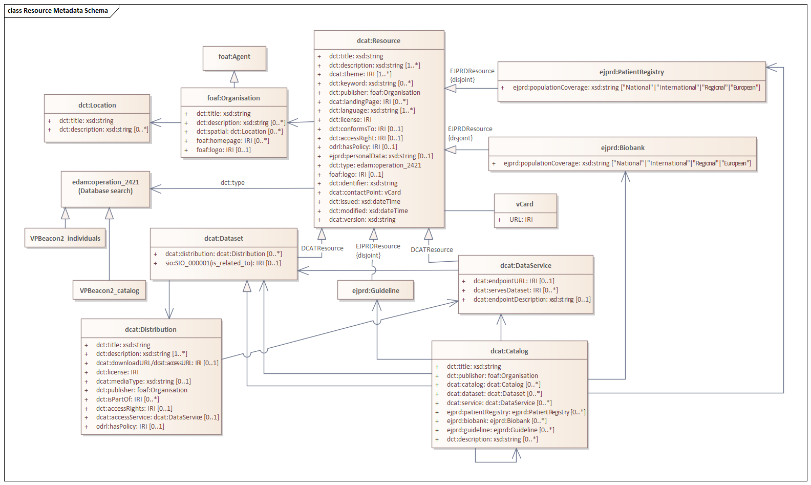

# Metadata for EJP rare disease patient registries, biobanks and catalogs

As part of the [European Joint Programme (EJP) for Rare Disease](http://www.ejprarediseases.org), we are developing standards for rare disease registries to describe their metadata that will improve the FAIR-ness of these resources.

The core model is designed to represent data about a rare disease patient and biosample registries. The model is based on and builds on existing standards, such as the [European Rare Disease Registry Infrastructure](https://eu-rd-platform.jrc.ec.europa.eu) and the [Common Data Elements](http://www.erare.eu/sites/default/files/SetCommonData-EU%20RD%20Platform_CDS%20_final.pdf) from the rare disease community and other more generalised standards for data sharing such as the W3C [DCAT vocabulary](https://www.w3.org/TR/vocab-dcat/). We are also working to align with similar schema standarisation efforts such as [RD connect semantic model](https://github.com/LUMC-BioSemantics/Rare-Disease-Semantic-Model), [schema.org](https://schema.org), [bioschemas](https://bioschemas.org), [MIABIS](https://github.com/MIABIS/miabis/wiki) and [GA4GH](https://www.ga4gh.org) (see also [schema blocks](https://schemablocks.org) and [phenopackets](http://phenopackets.org). A proposed semantic model for the Common Data Elements can be found [here](https://github.com/ejp-rd-vp/CDE-semantic-model).

> Status: This is version 1.0 of EJP RD metadata model.

## Metadata modules overview

The figure below gives an overview of upper level concepts and properties used in our metadata model.

 
	 

 

You can browse different metadata modules by visiting the links below.

* [Organisation](docs/organisation.md) - describes a organisation
* [Location](docs/location.md) - describes a location
* [Catalog](docs/catalog.md) - describes a resource catalog
* [Resource](docs/resource.md) - describes any digital resource
	* [Patient Registry](docs/patient-registry.md) - describes a patient registry
	* [Biobank](docs/biobank.md) - describes a biobank
	* [Guideline](docs/guideline.md) - describes a guideline
	* [Dataset](docs/dataset.md) - describes a dataset

### Ontologies used in the metadata model

To describe different metadata modules listed above we used various exiting ontologies and vocabularies which are listed below.

* [DCMI Metadata Terms (DCT)](https://www.dublincore.org/specifications/dublin-core/dcmi-terms/)
* [Data Catalog Vocabulary (DCAT) - Version 2](https://www.w3.org/TR/vocab-dcat-2)
* [FOAF Vocabulary (FOAF)](http://xmlns.com/foaf/spec/)

Concepts to describe resources that we use in the Rare diseases domain such as biobank and patient registry are <b>not</b> defined in resource description vocabulary as a DCAT. To overcome this issue we have extended DCAT with by added missing concepts to DCAT vocabulary.

* [Data Catalog Vocabulary extension](https://github.com/ejp-rd-vp/resource-metadata-schema-ontology)

 

### Implementation of metadata model

The metadata modules described in this repository are provided with RDF examples and RDF validation artifacts. You get more benefits if you implement metadata model in RDF. However implementation of our metadata model is not limited only to RDF.

## Use cases

Below you can find some use cases which can be addressed by proposed metadata modules. 

* Provide minimal metadata to describe a rare disease registry or biobank, or a catalog of registries or biobanks. The metadata should
be sufficient to expose data about these resource through the virtual platform
* Provide a uniform way for resources to expose the primary disease using a Orphanet code so that resources can be searched by disease in the virtual platform
* Provide a mechanism to identify resources and harmonies duplicate resources across catalogs
* Provide geographical information so resources can be filtered by country in the VP
* Expose if resources provide metrics about individuals, such as number of cases
* Expose if a resource has access to biological samples, such as tissue or cell ines.
* Expose if the resource has further contact information
* ...

## Steps for defining the metadata of your resource
Detailed steps and the related Google/Excel spreadsheet template can be found [here](template/README.md) 
