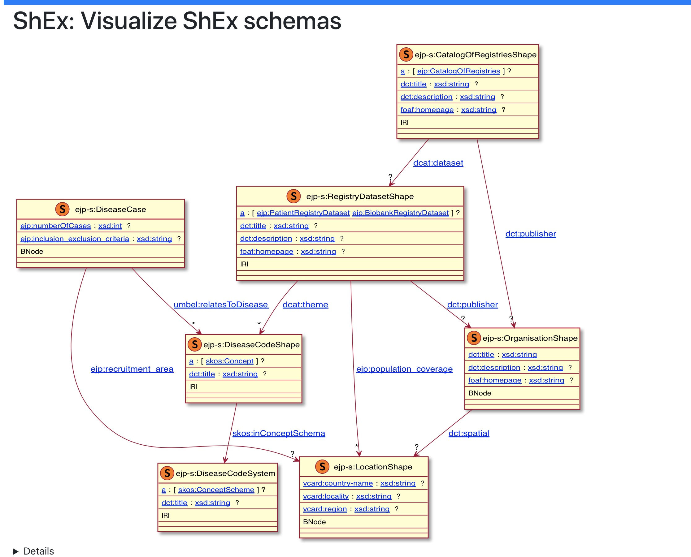

# EJP metadata schema

As part of the [European Joint Programme (EJP) for Rare Disease](http://www.ejprarediseases.org), we are developing standards for rare disease registries to describe their metadata that will imporve the FAIR-ness of these resources.

{: .center-image }

The core model is designed to represent data about a rare disease patient and biosample registry. The model is currently small and intended to address basic use-cases for registry discovery. An abstract view of the model is depicted below.

{: .center-image }

## The schemas

The schema can be serialised as JSON documents. We provide JSON schema documents  for the following objects:

- [Rare disease catalog](./catalog_of_registries.md) – `catalog_of_registries.json`
- [Rare disease registry dataset](./registry.md) – `registry.json`
- [Case or observation](./case.md) – `case.json`
- [Code](./vocabulary_code.md) – `vocabulary_code.json`
- [Coding system](./vocabulary_code_system.md) – `vocabulary_code_system.json`
- [Location](./location.md) – `location.json`
- [Organisation](./organisation.md) – `organisation.json`

The schema is available as an RDF/OWL file, and the [W3C Shape expression language](metadata_model.shex)(SHEx).

## Example data

TODO - add links to example documents.

## Contributing

This is an open community project. You can contribute to the schemas via our [GitHub repository](http://github.com/ejp-rd-vp/resource-metadata-schema).
