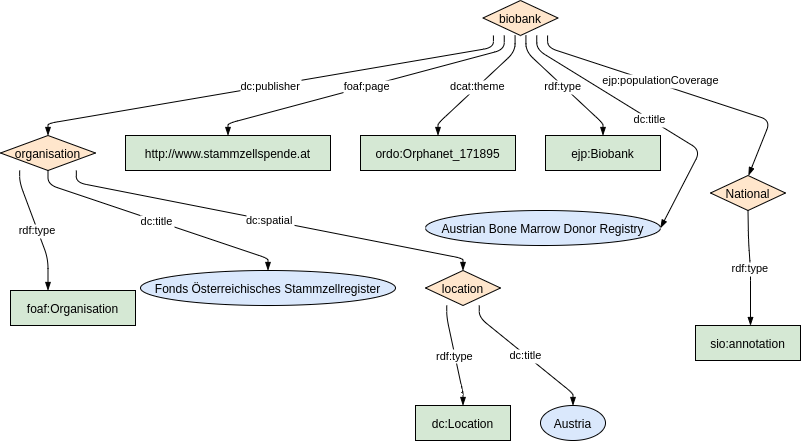

To represent biobanks, the [Minimum Information About BIobank data Sharing](https://github.com/BBMRI-ERIC/miabis) (MIABIS) has been used as a reference.

MIABIS contains two concepts at Resource level:

* Sample Collection: represents a set of samples with at least one common characteristic.
* Biobank: is defined as an organization or an organizational unit that stores samples and data related to the samples. In MIABIS Core 2.0 biobanks do not contain samples directly, but they are hosting sample collections.


These two concepts of MIABIS have been modelled similarly to Dataset and denoted more specifically using classes from [OBIB](https://www.ebi.ac.uk/ols4/ontologies/obib) ontology.


### Metadata model figure

<p align="center"> 
    <a href="../images/turtle/biobank.png" target="_blank">
         
    </a>
</p>


***

### Example rdf (turtle)

```ttl
@prefix : <http://purl.org/ejp-rd/metadata-model/v1/example-rdf/> .
@prefix rdf: <http://www.w3.org/1999/02/22-rdf-syntax-ns#> .
@prefix rdfs: <http://www.w3.org/2000/01/rdf-schema#> .
@prefix dcat: <http://www.w3.org/ns/dcat#> .
@prefix xsd: <http://www.w3.org/2001/XMLSchema#> .
@prefix owl: <http://www.w3.org/2002/07/owl#> .
@prefix dct: <http://purl.org/dc/terms/> .
@prefix lang: <http://id.loc.gov/vocabulary/iso639-1/> .
@prefix foaf: <http://xmlns.com/foaf/0.1/> .
@prefix obo: <http://purl.obolibrary.org/obo/> .
@prefix vcard: <http://www.w3.org/2006/vcard/ns#> .
@prefix ordo: <http://www.orpha.net/ORDO/> .
@prefix datacite: <http://purl.org/spar/datacite/> .


:collection
  a obo:OBIB_0000616, dcat:Resouce;
  dct:identifier "collection-id";
  dct:title "Muscle Tissue Collection";
  dct:description "Example collection of samples";
  dct:alternative "MTC";
  dcat:theme ordo:Orphanet_589;
  dcat:keyword "Myastenia gravis"
  dct:publisher :biobank;
  dcat:landingPage <https://mtc.brd.org>;
  dct:language <http://lexvo.org/id/iso639-3/eng>;
  ejprd:personalData "true";
  dcat:contactPoint [ a vcard:Individual;
      vcard:email <mailto:info@ejprdbiobank.org>;
      vcard:hasGivenName "John";
      vcard:hasFamilyName "Smith";
      vcard:hasHonorificSuffix "PhD"
    ].

:biobank
  a obo:OBIB_0000623, foaf:Organization;
  dct:identifier "biobank-id";
  dct:title "Biobank of Rare Diseases";
  dct:alternative "BRD";
  dct:description "Biobank with collections of biopsies of muscular diseases";
  dcat:landingPage <https://brd.org>;
  dct:spatial  <http://publications.europa.eu/resource/authority/country/AUT>;;
  obo:RO_0000053 :biobankOrganization;  # has characteristic. The object MUST be of type Legal en
  obo:OBIB_0000732 :collection .
  dcat:contactPoint [ a vcard:Organization;
      vcard:url <https://brd.org/contacts>
 ].
  

:biobankOrganization 
  a obo:OMRSE_00000038;
  foaf:name "University of Muscle Diseases" .``
