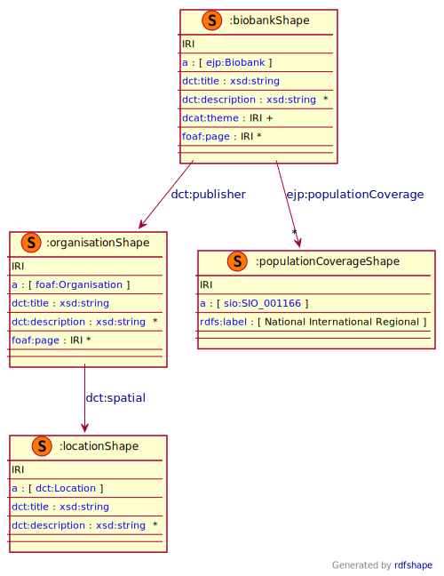

To represent biobanks, the [Minimum Information About BIobank data Sharing](https://github.com/BBMRI-ERIC/miabis) (MIABIS) has been used as a reference.

MIABIS contains two concepts at Resource level:

* Sample Collection: represents a set of samples with at least one common characteristic
* Biobank: is defined as an organization or an organizational unit that stores samples and data related to the samples. In MIABIS Core 2.0 biobanks do not contain samples directly, but they are hosting sample collections.

These two concepts of MIABIS have been mapped to DCAT:Resources and denoted using classes from [OBIB](https://www.ebi.ac.uk/ols4/ontologies/obib) ontology.


### Metadata model figure

<p align="center"> 
    <a href="../images/turtle/biobank.png" target="_blank">
         
    </a>
</p>


***

### Example rdf (turtle)

```ttl
@prefix : <http://purl.org/ejp-rd/metadata-model/v1/example-rdf/> .
@prefix rdf: <http://www.w3.org/1999/02/22-rdf-syntax-ns#> .
@prefix rdfs: <http://www.w3.org/2000/01/rdf-schema#> .
@prefix dcat: <http://www.w3.org/ns/dcat#> .
@prefix xsd: <http://www.w3.org/2001/XMLSchema#> .
@prefix owl: <http://www.w3.org/2002/07/owl#> .
@prefix dct: <http://purl.org/dc/terms/> .
@prefix lang: <http://id.loc.gov/vocabulary/iso639-1/> .
@prefix fdp-o: <https://w3id.org/fdp/fdp-o#> .
@prefix foaf: <http://xmlns.com/foaf/0.1/> .
@prefix obo: <http://purl.obolibrary.org/obo/> .
@prefix vcard: <http://www.w3.org/2006/vcard/ns#> .
@prefix ordo: <http://www.orpha.net/ORDO/> .
@prefix datacite: <http://purl.org/spar/datacite/> .


:collection
  a obo:OBIB_0000645, dcat:Dataset;
  dct:identifier "collection-id";
  dct:isPartOf :catalog;
  obo:BFO_0000050 :biobank;
  dct:title "Muscle tissue collection";
  dcat:contactPoint [ a vcard:Individual;
      vcard:email <mailto:info@ejprdbiobank.org>;
      vcard:hasGivenName "John";
      vcard:hasFamilyName "Smith";
      vcard:hasHonorificSuffix "PhD"
    ];
  dct:description "Example collection of samples";
  dcat:theme ordo:Orphanet_589;
  fdp-o:metadataIdentifier [ a datacite:Identifier;
      dct:identifier :collection
    ] .

:biobank
  a obo:OBIB_0000616, dcat:Resource;
  dct:identifier "biobank-id";
  dct:title "Biobank of Rare Diseases";
  dct:alternative "BRD";
  dct:description "Biobank with collections of biopsies of muscular diseases";
  dcat:landingPage <https://examplebiobank.org>;
  obo:OBIB_0000735 :biobankOrganization;
  dct:spatial  <http://publications.europa.eu/resource/authority/country/AUT>;;
  dcat:contactPoint [ a vcard:Individual;
      vcard:email <mailto:director@ejprdbiobank.org>;
      vcard:hasGivenName "Mario";
      vcard:hasFamilyName "Rossi";
      vcard:hasHonorificSuffix "PhD"
    ];
  obo:BFO_0000051 :collection;
  fdp-o:metadataIdentifier [ a datacite:Identifier;
      dct:identifier :biobank
  ] .

:biobankOrganization 
  a obo:OBIB_0000623, foaf:Organization;
  foaf:name "University of Mus
```

***

### Validation artifacts 

##### ShEx figure

<p align="center"> 
    <a href="../images/shex/biobank.svg" target="_blank">
         
    </a>
</p>

***
##### ShEx

``` ShEx
PREFIX : <http://purl.org/ejp-rd/metadata-model/v1/shex/>
PREFIX dcat:  <http://www.w3.org/ns/dcat#>
PREFIX dct:   <http://purl.org/dc/terms/>
PREFIX ejprd:   <http://purl.org/ejp-rd/vocabulary/>
PREFIX foaf:  <http://xmlns.com/foaf/0.1/>
PREFIX xsd: <http://www.w3.org/2001/XMLSchema#>
PREFIX sio:  <http://semanticscience.org/resource/>
PREFIX rdfs:  <http://www.w3.org/2000/01/rdf-schema#>
PREFIX odrl: <https://www.w3.org/TR/odrl-model/>
PREFIX rdf: <http://www.w3.org/1999/02/22-rdf-syntax-ns#>
PREFIX obo: <http://purl.obolibrary.org/obo/>
PREFIX vcard: <http://www.w3.org/2006/vcard/ns#>
PREFIX datacite: <http://purl.org/spar/datacite/> 

# Collection in MIABIS 2.0 represents a set of samples with at least one common characteristic (
:collectionShape IRI {
  rdf:type [dcat:Resource dcat:Dataset obo:OBIB_0000625]; # obo:OBIB_0000625 is "Hosted Study Collection"
  dct:identifier xsd:string;
  dct:title xsd:string;
  dct:alternative xsd:string*;
  dct:description xsd:string*;
  dcat:theme IRI+;  # theme is used for the diseases in the collection expressed using ORDO
  dcat:keyword xsd:string*;
  dct:publisher [foaf:Agent];
  dcat:landingPage IRI*;
  dct:language xsd:string+;
  dct:contactPoint [vcard:Individual];
  obo:BFO_0000050 @:biobankShape # obo:BFO_0000050 is "part of"
  # missing mapping of some properties that are present in MIABIS:
  # age low
  # age high
  # age unit
  # data categories
  # material type
  # storage temperature
  # collection type
}

# In MIABIS, Biobank is defined as an organization or an organizational unit that stores samples and data related to the samples.
# Only Organizational property are used to describe a Biobank
:biobankShape IRI {
  rdf:type [dcat:Resource obo:OBIB_0000616]; # obo:OBIB_0000616 is Biobank
  dct:identifier xsd:string;
  dct:title xsd:string;
  dct:alternative xsd:string*;
  dct:description xsd:stirng*;
  dcat:landingPage IRI*;
  obo:OBIB_0000735 :biobankOrganizationShape; # obo:OBIB_0000735 is "owned by"
  dct:spatial IRI*;
  dcat:contactPoint [vcard:Individual];
  obo:BFO_0000051 @:collectionShape+; # obo:BFO_0000051 is "has part"
}

:biobankOrganizationShape IRI {
  rdf:type [foaf:Organization obo:OBIB_0000623]; # obo:OBIB_0000623 is Biobank Organization
  obo:OBIB_0000732 @:biobankShape # OBIB_0000732 is "owns"
}
```
