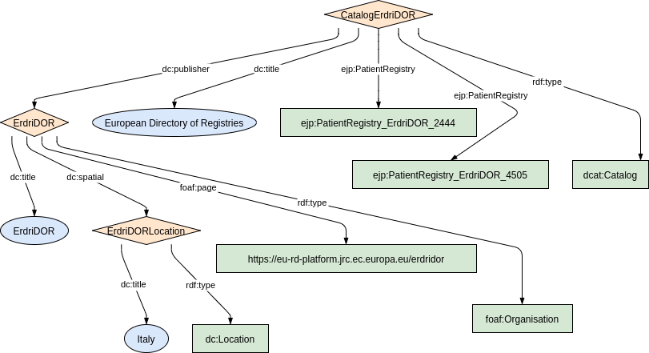
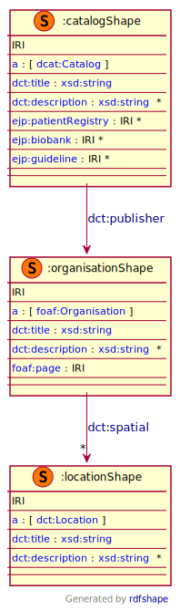

### Metadata model figure

<p align="center"> 
    <a href="../images/turtle/catalog.png" target="_blank">
         
    </a>
</p>


***

### Example rdf (turtle)

```ttl
@prefix : <http://purl.org/ejp-rd/metadata-model/v1/example-rdf/> .
@prefix dcat:  <http://www.w3.org/ns/dcat#> .
@prefix dct:   <http://purl.org/dc/terms/> .
@prefix ejp:   <https://w3id.org/ejp-rd/vocabulary#> .
@prefix foaf:  <http://xmlns.com/foaf/0.1/> .

:location a dct:Location ;
  dct:title  "Germany" .

:ErdriDOR  a  foaf:Organisation ;
  dct:title "ErdriDOR";
  dct:spatial  :location ;
  foaf:page    <https://eu-rd-platform.jrc.ec.europa.eu/erdridor/> .

:catalog a dcat:Catalog ;
  dct:publisher :ErdriDOR ;
  dct:title "European directory of resources" .
```

***

### Validation artifacts 

##### ShEx figure

<p align="center"> 
    <a href="../images/shex/catalog.svg" target="_blank">
         
    </a>
</p>

***
##### ShEx

``` ShEx
PREFIX : <http://purl.org/ejp-rd/metadata-model/v1/shex/>
PREFIX dcat:  <http://www.w3.org/ns/dcat#>
PREFIX dct:   <http://purl.org/dc/terms/>
PREFIX ejp:   <https://w3id.org/ejp-rd/vocabulary#>
PREFIX foaf:  <http://xmlns.com/foaf/0.1/>
PREFIX xsd: <http://www.w3.org/2001/XMLSchema#>

:catalogShape IRI {
  a [dcat:Catalog];
  dct:title xsd:string;
  dct:description xsd:string*;
  dct:publisher @:organisationShape;
  ejp:patientRegistry IRI*;
  ejp:biobank IRI*;
  ejp:guideline IRI*
}

:locationShape IRI {
  a [dct:Location];
  dct:title xsd:string;
  dct:description xsd:string*;
}

:organisationShape IRI {
  a [foaf:Organisation];
  dct:title xsd:string;
  dct:description xsd:string*;
  dct:spatial @:locationShape*;
  foaf:page IRI
}
```

#### Note
The properties `ejp:patientRegistry`, `ejp:biobank`, `ejp:guideline` are mentioned as `optional` in the ShEx. It is because these properties are need to be used based on the children resources represented in the catalog. See the example RDF below to get an idea how to use these properties.

##### Example rdf for biobanks (turtle)

```ttl
@prefix : <http://purl.org/ejp-rd/metadata-model/v1/example-rdf/> .
@prefix dcat:  <http://www.w3.org/ns/dcat#> .
@prefix dct:   <http://purl.org/dc/terms/> .
@prefix ejp:   <https://w3id.org/ejp-rd/vocabulary#> .
@prefix foaf:  <http://xmlns.com/foaf/0.1/> .

:location a dct:Location ;
  dct:title  "Germany" .

:ErdriDOR  a  foaf:Organisation ;
  dct:title "ErdriDOR";
  dct:spatial  :location ;
  foaf:page    <https://eu-rd-platform.jrc.ec.europa.eu/erdridor/> .

:catalog a dcat:Catalog ;
  dct:publisher :ErdriDOR ;
  dct:title "European directory of biobanks" ;
  ejp:biobank :biobank1, :biobank2 .
```


##### Example rdf for patient registries (turtle)

```ttl
@prefix : <http://purl.org/ejp-rd/metadata-model/v1/example-rdf/> .
@prefix dcat:  <http://www.w3.org/ns/dcat#> .
@prefix dct:   <http://purl.org/dc/terms/> .
@prefix ejp:   <https://w3id.org/ejp-rd/vocabulary#> .
@prefix foaf:  <http://xmlns.com/foaf/0.1/> .

:location a dct:Location ;
  dct:title  "Germany" .

:ErdriDOR  a  foaf:Organisation ;
  dct:title "ErdriDOR";
  dct:spatial  :location ;
  foaf:page    <https://eu-rd-platform.jrc.ec.europa.eu/erdridor/> .

:catalog a dcat:Catalog ;
  dct:publisher :ErdriDOR ;
  dct:title "European directory of patient registries" ;
  ejp:patientRegistry :patientRegistry1, :patientRegistry2 .
```


##### Example rdf for guidelines (turtle)

```ttl
@prefix : <http://purl.org/ejp-rd/metadata-model/v1/example-rdf/> .
@prefix dcat:  <http://www.w3.org/ns/dcat#> .
@prefix dct:   <http://purl.org/dc/terms/> .
@prefix ejp:   <https://w3id.org/ejp-rd/vocabulary#> .
@prefix foaf:  <http://xmlns.com/foaf/0.1/> .

:location a dct:Location ;
  dct:title  "Germany" .

:ErdriDOR  a  foaf:Organisation ;
  dct:title "ErdriDOR";
  dct:spatial  :location ;
  foaf:page    <https://eu-rd-platform.jrc.ec.europa.eu/erdridor/> .

:catalog a dcat:Catalog ;
  dct:publisher :ErdriDOR ;
  dct:title "European directory of patient guidelines" ;
  ejp:guideline :guideline1, :guideline2 .
```
