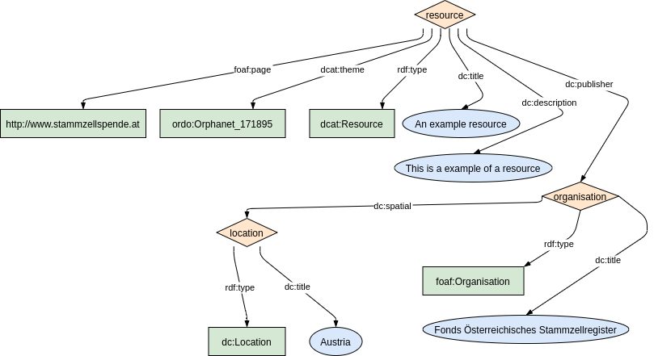
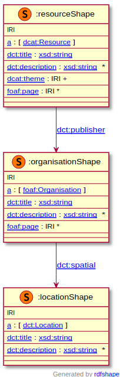

`dcat:Dataservice`

### Metadata model figure

<p align="center"> 
    <a href="../images/turtle/dataset.png" target="_blank">
         
    </a>
</p>


***

### Example rdf (turtle)

```ttl


```

***

### Validation artifacts

##### ShEx figure

<p align="center"> 
    <a href="../images/shex/dataset.png" target="_blank">
         
    </a>
</p>

***
##### ShEx

``` ShEx

```
