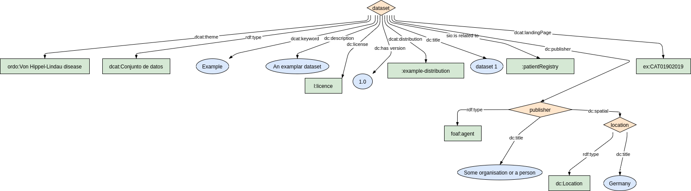
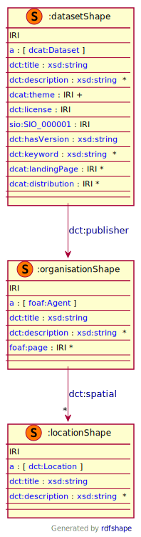
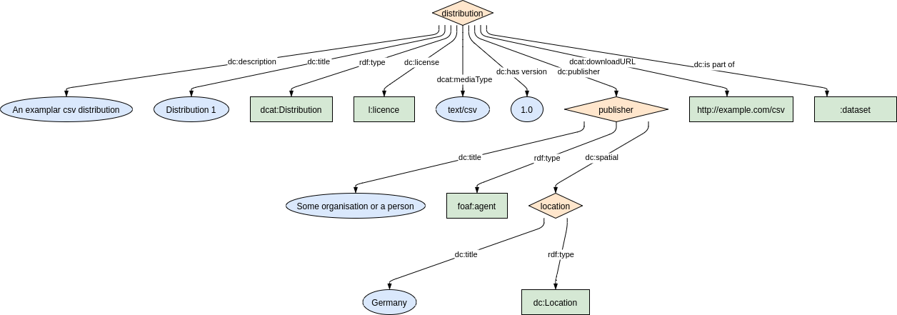
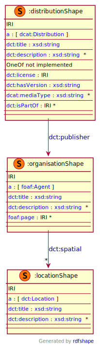
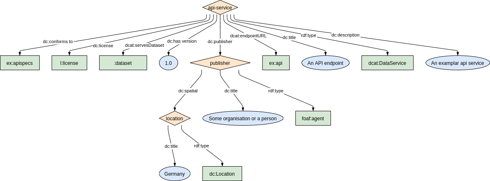
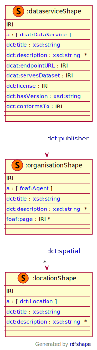

DCAT vocabulary has already has concept `dcat:Dataset` which is a sub-class of `dcat:Resource`. We use this concept to describe any rare disease related dataset. When a dataset is about content of a rare disease resources such as `biobank` and `patient registry` then we recommend using `sio:is related to` property to connect the dataset to its rare disease resource.

### Metadata model figure

<p align="center"> 
    <a href="../images/turtle/dataset.png" target="_blank">
         
    </a>
</p>


***

### Example rdf (turtle)

```ttl
@prefix : <http://purl.org/ejp-rd/metadata-model/v1/example-rdf/> .
@prefix dcat:  <http://www.w3.org/ns/dcat#> .
@prefix dct:   <http://purl.org/dc/terms/> .
@prefix foaf:  <http://xmlns.com/foaf/0.1/> .
@prefix ordo: <http://www.orpha.net/ORDO/> .
@prefix sio: <http://semanticscience.org/resource/> .

:dataset a dcat:Dataset ;
  dct:publisher :publisher ;        
  dct:title "dataset 1" ;
  dct:description "An examplar dataset" ;
  dcat:theme  ordo:Orphanet_892 ;
  dcat:keyword "Test", "Example" ;
  dct:license <https://creativecommons.org/licenses/by/4.0> ;
  dct:hasVersion "1.0" ;
  sio:SIO_000001 :patientRegistry;
  dcat:distribution :example-distribtion;
  dcat:landingPage <http://example.org/CAT01902019> .

:publisher a foaf:Agent ;
  dct:title "Some organisation or a person" ;
  dct:spatial  :location .
  
:location a dct:Location ;
  dct:title  "Germany" .
```

***

### Validation artifacts

##### ShEx figure

<p align="center"> 
    <a href="../images/shex/dataset.svg" target="_blank">
         
    </a>
</p>

***
##### ShEx

``` ShEx
PREFIX : <http://purl.org/ejp-rd/metadata-model/v1/shex/>
PREFIX dcat:  <http://www.w3.org/ns/dcat#>
PREFIX dct:   <http://purl.org/dc/terms/>
PREFIX ejp:   <http://purl.org/ejp-rd/vocabulary/>
PREFIX foaf:  <http://xmlns.com/foaf/0.1/>
PREFIX xsd: <http://www.w3.org/2001/XMLSchema#>
PREFIX sio: <http://semanticscience.org/resource/>

:datasetShape IRI {
  a [dcat:Dataset];
  dct:title xsd:string;
  dct:description xsd:string*;
  dcat:theme IRI+;
  dct:license IRI;
  sio:SIO_000001 IRI;
  dct:hasVersion xsd:string;
  dct:keyword xsd:string*;
  dct:publisher @:organisationShape;
  dcat:landingPage IRI*;
  dcat:distribution IRI*
}

:locationShape IRI {
  a [dct:Location];
  dct:title xsd:string;
  dct:description xsd:string*;
}

:organisationShape IRI {
  a [foaf:Agent];
  dct:title xsd:string;
  dct:description xsd:string*;
  dct:spatial @:locationShape*;
  foaf:page IRI*
}
```


Often a dataset can be made available for use via data dump such as RDF,mysql data dump or via services which serves the dataset such as an API. In this section we describe how one can describe various distributions of dataset.

## How to describe data dump

### Metadata model figure

<p align="center"> 
    <a href="../images/turtle/distribution.png" target="_blank">
         
    </a>
</p>


***

### Example rdf (turtle)

```ttl
@prefix : <http://purl.org/ejp-rd/metadata-model/v1/example-rdf/> .
@prefix dcat:  <http://www.w3.org/ns/dcat#> .
@prefix dct:   <http://purl.org/dc/terms/> .
@prefix foaf:  <http://xmlns.com/foaf/0.1/> .

:distribution a dcat:Distribution ;
  dct:publisher :publisher ;        
  dct:title "Distribution 1" ;
  dct:description "An examplar csv distribution" ;
  dct:license <https://creativecommons.org/licenses/by/4.0> ;
  dct:hasVersion "1.0" ;
  dcat:downloadURL <https://ftp.example.com/test.csv>;
  dcat:mediaType "text/csv";
  dct:isPartOf :dataset .

:publisher a foaf:Agent ;
  dct:title "Some organisation or a person" ;
  dct:spatial  :location .
  
:location a dct:Location ;
  dct:title  "Germany" .
```

***

### Validation artifacts

##### ShEx figure

<p align="center"> 
    <a href="../images/shex/distribution.svg" target="_blank">
         
    </a>
</p>

***
##### ShEx

``` ShEx
PREFIX : <http://purl.org/ejp-rd/metadata-model/v1/shex/>
PREFIX dcat:  <http://www.w3.org/ns/dcat#>
PREFIX dct:   <http://purl.org/dc/terms/>
PREFIX ejp:   <http://purl.org/ejp-rd/vocabulary/>
PREFIX foaf:  <http://xmlns.com/foaf/0.1/>
PREFIX xsd: <http://www.w3.org/2001/XMLSchema#>

:distributionShape IRI {
  a [dcat:Distribution];
  dct:title xsd:string;
  dct:description xsd:string*;
  (dcat:downloadURL IRI | dcat:accessURL IRI);  
  dct:license IRI;
  dct:hasVersion xsd:string;
  dcat:mediaType xsd:string*;
  dct:publisher @:organisationShape;
  dct:isPartOf IRI*
}

:locationShape IRI {
  a [dct:Location];
  dct:title xsd:string;
  dct:description xsd:string*;
}

:organisationShape IRI {
  a [foaf:Agent];
  dct:title xsd:string;
  dct:description xsd:string*;
  dct:spatial @:locationShape*;
  foaf:page IRI*
}
```

#### Note:
When you create a distribution entry please make sure that the distribution entry's link is described in the appropriate dataset via `dcat:distribution` predicate. 

## How to describe data services

### Metadata model figure

<p align="center"> 
    <a href="../images/turtle/dataservice.png" target="_blank">
         
    </a>
</p>


***

### Example rdf (turtle)

```ttl
@prefix : <http://purl.org/ejp-rd/metadata-model/v1/example-rdf/> .
@prefix dcat:  <http://www.w3.org/ns/dcat#> .
@prefix dct:   <http://purl.org/dc/terms/> .
@prefix foaf:  <http://xmlns.com/foaf/0.1/> .

:api-service a dcat:DataService ;
   dct:publisher :publisher ;        
   dct:title "An API endpoint" ;
   dct:description "An examplar api service" ;
   dct:license <https://creativecommons.org/licenses/by/4.0> ;
   dct:hasVersion "1.0" ;
   dct:conformsTo <http://example.org/apispecs> ;
   dcat:endpointURL <http://example.org/api> ;
   dcat:servesDataset :dataset .
   
:publisher a foaf:Agent ;
  dct:title "Some organisation or a person" ;
  dct:spatial  :location .
  
:location a dct:Location ;
  dct:title  "Germany" .
```

***

### Validation artifacts

##### ShEx figure

<p align="center"> 
    <a href="../images/shex/dataservice.svg" target="_blank">
         
    </a>
</p>

***
##### ShEx

``` ShEx
PREFIX : <http://purl.org/ejp-rd/metadata-model/v1/shex/>
PREFIX dcat:  <http://www.w3.org/ns/dcat#>
PREFIX dct:   <http://purl.org/dc/terms/>
PREFIX ejp:   <http://purl.org/ejp-rd/vocabulary/>
PREFIX foaf:  <http://xmlns.com/foaf/0.1/>
PREFIX xsd: <http://www.w3.org/2001/XMLSchema#>

:dataserviceShape IRI {
  a [dcat:DataService];
  dct:title xsd:string;
  dct:description xsd:string*;
  dcat:endpointURL IRI;
  dcat:servesDataset IRI;
  dct:license IRI;
  dct:hasVersion xsd:string;
  dct:publisher @:organisationShape;
  dct:conformsTo IRI
}

:locationShape IRI {
  a [dct:Location];
  dct:title xsd:string;
  dct:description xsd:string*;
}

:organisationShape IRI {
  a [foaf:Agent];
  dct:title xsd:string;
  dct:description xsd:string*;
  dct:spatial @:locationShape*;
  foaf:page IRI*
}
```