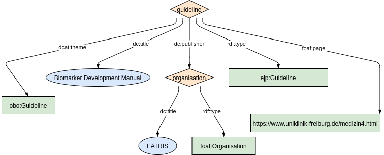
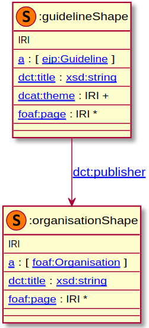

`ejp:Guideline` concept is a custom extension we added to the DCAT2 vocabulary. In our extension we defined `ejp:Guideline` is a subclass of `dcat:Resource`.

### Metadata model figure

<p align="center"> 
    <a href="../images/turtle/guideline.png" target="_blank">
         
    </a>
</p>


***

### Example rdf (turtle)

```ttl
@prefix : <http://purl.org/ejp-rd/metadata-model/v1/example-rdf/> .
@prefix dcat:  <http://www.w3.org/ns/dcat#> .
@prefix dct:   <http://purl.org/dc/terms/> .
@prefix ejp:   <http://purl.org/ejp-rd/vocabulary/> .
@prefix foaf:  <http://xmlns.com/foaf/0.1/> .
@prefix rdfs:  <http://www.w3.org/2000/01/rdf-schema#> .
@prefix obo: <http://purl.obolibrary.org/obo/> .

:guideline a ejp:Guideline ;
  dct:publisher :organisation ;        
  dct:title "Biomarker Development Manual" ;
  dcat:theme  obo:NCIT_C17564 ;
  foaf:page <https://www.uniklinik-freiburg.de/medizin4.html> .

:organisation a foaf:Organisation ;
  dct:title "EATRIS" .
```

***

### Validation artifacts 

##### ShEx figure

<p align="center"> 
    <a href="../images/shex/guideline.png" target="_blank">
         
    </a>
</p>

***
##### ShEx

``` ShEx
PREFIX : <http://purl.org/ejp-rd/metadata-model/v1/shex/>
PREFIX dcat:  <http://www.w3.org/ns/dcat#>
PREFIX dct:   <http://purl.org/dc/terms/>
PREFIX ejp:   <http://purl.org/ejp-rd/vocabulary/>
PREFIX foaf:  <http://xmlns.com/foaf/0.1/>
PREFIX xsd: <http://www.w3.org/2001/XMLSchema#>
PREFIX rdfs:  <http://www.w3.org/2000/01/rdf-schema#>

:guidelineShape IRI {
  a [ejp:Guideline];
  dct:title xsd:string;
  dcat:theme IRI+;
  dct:publisher @:organisationShape;
  foaf:page IRI*
}

:organisationShape IRI {
  a [foaf:Organisation];
  dct:title xsd:string;
  foaf:page IRI*
}
```
