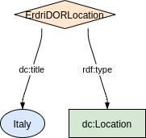
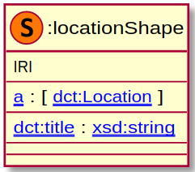

### Metadata model figure

<p align="center"> 
    <a href="../images/turtle/location.png" target="_blank">
         
    </a>
</p>


***

### Example rdf (turtle)

```ttl
@prefix : <http://purl.org/ejp-rd/metadata-model/v1/example-rdf/> .
@prefix dct:   <http://purl.org/dc/terms/> .
  
:ErdriDORLocation a dct:Location ;
  dct:title  "Italy" .
```

***

### Validation artifacts 

##### ShEx figure

<p align="center"> 
    <a href="../images/shex/location.png" target="_blank">
         
    </a>
</p>

***
##### ShEx

``` ShEx
PREFIX : <http://purl.org/ejp-rd/metadata-model/v1/shex/>
PREFIX dct:   <http://purl.org/dc/terms/>
PREFIX xsd: <http://www.w3.org/2001/XMLSchema#>

:locationShape IRI {
  a [dct:Location];
  dct:title xsd:string;
  dct:description xsd:string*;
}
```

#### Note
The current model is very simple because it reflects the location information captured in the resources. In the current state from resources it is hard to figure out if the location is of type country, city etc. However if this issue is fixed in the resources then we can easily extend above model. See the example RDF below.


### Example rdf extended (turtle)

```ttl
@prefix : <http://purl.org/ejp-rd/metadata-model/v1/example-rdf/> .
@prefix dct:   <http://purl.org/dc/terms/> .
@prefix openvoc: <http://open.vocab.org/terms/> .
@prefix rdfs: <http://www.w3.org/2000/01/rdf-schema#> . 
  
:ErdriDORLocation a dct:Location, openvoc:Country ;
  dct:title  "Italy";
  rdfs:seeAlso <http://www.wikidata.org/entity/Q38>, <http://sws.geonames.org/3175395/> .
  
```
