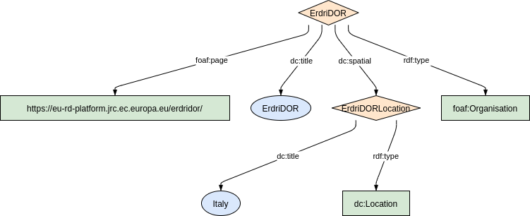
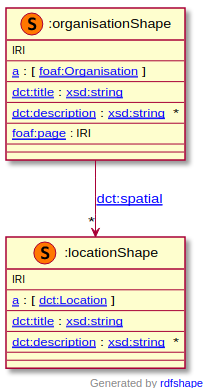

### Metadata model figure

<p align="center"> 
    <a href="../images/turtle/organisation.png" target="_blank">
         
    </a>
</p>


***

### Example rdf (turtle)

```ttl
@prefix : <http://purl.org/ejp-rd/metadata-model/v1/example-rdf/> .
@prefix dct:   <http://purl.org/dc/terms/> .
@prefix foaf:  <http://xmlns.com/foaf/0.1/> .

:ErdriDOR  a  foaf:Organisation ;
  dct:title "ErdriDOR";
  dct:spatial  :ErdriDORLocation ;
  foaf:page    <https://eu-rd-platform.jrc.ec.europa.eu/erdridor/> .
  
:ErdriDORLocation a dct:Location ;
  dct:title  "Italy" .
```

***

### Validation artifacts 

##### ShEx figure

<p align="center"> 
    <a href="../images/shex/organisation.png" target="_blank">
         
    </a>
</p>

***
##### ShEx

``` ShEx
PREFIX : <http://purl.org/ejp-rd/metadata-model/v1/shex/>
PREFIX dct:   <http://purl.org/dc/terms/>
PREFIX foaf:  <http://xmlns.com/foaf/0.1/>
PREFIX xsd: <http://www.w3.org/2001/XMLSchema#>

:organisationShape IRI {
  a [foaf:Organisation];
  dct:title xsd:string;
  dct:description xsd:string*;
  dct:spatial @:locationShape*;
  foaf:page IRI
}

:locationShape IRI {
  a [dct:Location];
  dct:title xsd:string;
  dct:description xsd:string*;
}
```
