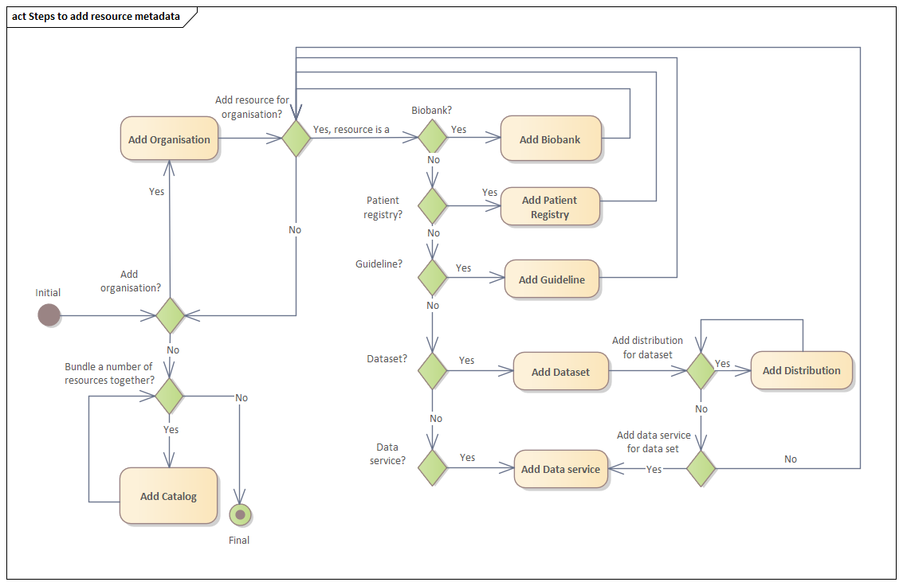

# How to describe a resource
Here we list the steps to describe the metadata for an EJPRD resource.

## Step 1
Download the [Excel spreadsheet](EJPRD%20Resource%20Metadata%20template.xlsx) or make a copy of the Google spreadsheet
[EJPRD Resource Metadata template](https://docs.google.com/spreadsheets/d/1y-x7yf8RLvp9oZS_5fvyH6SFLMNZzP6agTl6Z_wTkx0/edit?usp=sharing).

## Step 2
Fill in the different sheets in the spreadsheet as is appropriate for your organisation or organisations and the resources
they provide.

1. [Organisation](Organisation.md) - In order to add resources to the EJP RD Virtual Platform the organisations that provide
the resources need to be registered first. To add an organisation or organisations, the Organisation sheet needs to be 
filled in. For each organisation, the biobanks, patient registries, guidelines, datasets (which may have associated
data services) or data services (with no specific dataset), provided by the organisation, needs to be added.   
   1. [Biobank or patient registry](BiobankOrPatientRegistry.md) - This sheet only needs to be filled in when your organisation
   provides biobank or patient registry data.
   2. [Guideline](Guideline.md) - This sheet only needs to be filled in when your organisation provides a guideline.
   3. [Dataset](Dataset.md) - This sheet needs to be filled only when your organisation provides access to 1 or more datasets. 
   This sheet captures details about your dataset(s). However, a single dataset can have different ways in which they 
   are made available to potential users. How a dataset can be accessed is defined in the Distribution sheet.
      1. [Distribution](Distribution.md) - A single dataset can be made available in different ways. I.e., it can be downloaded or
      it can be accessed online.
   4. [Data Service](DataService.md) - If your organisation provides a service for its dataset to browse or search the 
   dataset across different versions of the dataset, this sheet needs to be filled in.
2. [Catalog](Catalog.md) - If your organisation wants to bundle numerous datasets, data services, biobanks, patient registries
or guidelines together under a single title, you need to fill in this sheet. 

## Step 3
Export the spreadsheet. We recommend you export the spreadsheet as a tab-delimited (TSV) file. This is because it is very likely
that commas will be used in descriptions, addresses etc. 

# Examples
## Simple Data Set - GWAS Associations

## Simple Data Service - OLS

## Catalog example - EBI providing access to OLS, OxO & GWAS.

